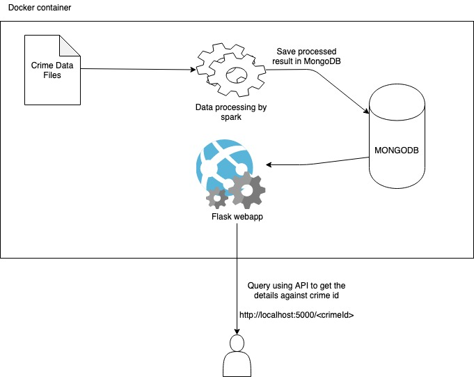

### Solution design:


1. Data Processing

 - We use Apache Spark (2.4) to read the CSV files and join the crime data with outcomes.
 - In case of the outcome files have duplicate crime id, we take the latest one based on the field 'Month'
 - The result of the join is saved to MongoDB using mongodb spark connector

2. MongoDB

 - It stores the crime data analysis result.
 - It is written by spark application and read by the web application

3. Web application

 - It is a flask application which takes the crime id from user and gets the corresponding details from mongo db.


### Running the solution:

 - Download the Dockerfile and docker-compose.yml from https://github.com/amitrmishra/TRG

 - Launch the docker container

`amitranjan$ docker-compose -f docker-compose.yml up -d`

Output:
```Creating network "trg_default" with the default driver
Creating trg_full_solution_1 ... done
```

Query the API

`amitranjan$ curl http://localhost:5000/98096d1a69205691a56b89c1182eadd6aaf15400ea18da134e0023f20aba5cdb`

Output:
```
{"crimeType": "Criminal damage and arson", "crimeId": "98096d1a69205691a56b89c1182eadd6aaf15400ea18da134e0023f20aba5cdb", "districtName": "avon-and-somerset", "longitude": "-2.513308", "lastOutcome": "Under investigation", "latitude": "51.409456"}
```

`amitranjan$ curl http://localhost:5000/7984cd127f0fa49c7fc6de29e042b51881910a716de1d12c49f7bbe9a809ecd4`

Output:
```
{"crimeType": "Vehicle crime", "crimeId": "7984cd127f0fa49c7fc6de29e042b51881910a716de1d12c49f7bbe9a809ecd4", "districtName": "avon-and-somerset", "longitude": null, "lastOutcome": "Offender given suspended prison sentence", "latitude": null}
```

`amitranjan$ curl http://localhost:5000/008c91375f27d3ec3b21d79e21fe5398accbf230483e8c60f4f63d86e7592f4a`

Output:
```
{"crimeType": "Violence and sexual offences", "crimeId": "008c91375f27d3ec3b21d79e21fe5398accbf230483e8c60f4f63d86e7592f4a", "districtName": "north-yorkshire", "longitude": "-1.084675", "lastOutcome": "Unable to prosecute suspect", "latitude": "53.972721"}
```

### Query using browser


### Stop the docker container
`amitranjan$ docker-compose -f docker-compose.yml down`

Output:
```
Stopping trg_full_solution_1 ... done
Removing trg_full_solution_1 ... done
Removing network trg_default
```
